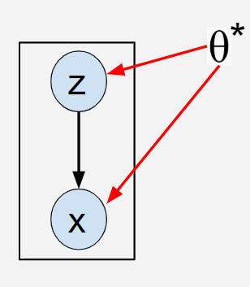
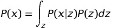
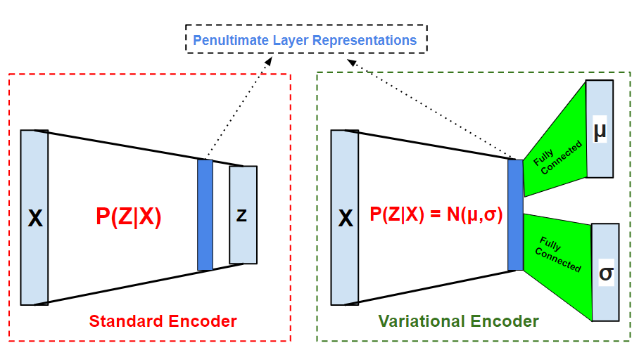

This is a preliminary report about the tutorial on Variational AutoEncoder. This report consists of short summary about the concepts and experiments that will be discussed in the tutorial.

# Outline
- Basics of autoencoders
- Generative models
- Problem Setting
- Connecting Neural Networks in Probability World
- Introduction to Variational autoencoder
- Maths behind Variational autoencoder
- Experiments 
  - Latent Space Visualizations
  - Visualization of cluster formation
  - Effect of change in weightage for KL divergance during training
  - Effect of weightage of KL divergance on disentangled representation learning
  - Shortcoming of VAE
- Applications of VAE

# Basics of Autoencoders
- Autoencoders are a special type of model where we try to reconstruct the input itself.

- One may ask why do we need to reconstruct the input if we already have the data. 

 
> The idea is pretty straightford here i.e in the process of reconstructing the input we would like the Autoencoder model to learn important properties(aka **features/representation** in machine learning world) which are enough informative to reconstruct the input itself.

*Autoencoder Model, [Image Source](https://becominghuman.ai/understanding-autoencoders-unsupervised-learning-technique-82fb3fbaec2)*

- Lets introduce some notations that will be used in upcoming sections
> X ==> input data  
> N ==> Number of instances in training data  
> Xi ==> ith instance of input data  
> D ==> dimension of input data  
> Z ==> dimension of latent space  
> P(X) ==> Probability distribution of Input  

- Now if we closely observe above model, then one can see that first Input image(Xi) is transformed to a latent space representation(Zi) and then reconstructed back to Input image(Xi). So here we expect the Zi to extract important features.

- There are two variants of autoencoder : 
	- _Overcomplete Autoencoders_
	> The autoencoders where **latent space dimension is more than the input dimension** are called as Overcomplete Autoencoders.
	>
	> It seems counter-intuitive in the first reading but it has been empirically shown that provided enough regularization on model parameters we can still can learn good representations.
	>
	> We will not discuss this variant in detail because it is out of the scope of tutorial.
	- _Undercomplete Autoencoders_
	> The autoencoders where **latent space dimension is significantly less than the input dimension** are called as Overcomplete Autoencoders.
	>
	> In this tutorial such type of an autoencoder is discussed in detail.

<!--These are machine learning models under unsupervised learning that come with a goal to learn good representations by trying to reconstruct the input itself. Main problem of autoencoders is not let it learn a identity function which is alleviated by regularized autoencoders(eg Sparse Autoencoders). Sparse Autoencoders come with a motive of getting sparse representations in latent space which essentially means that only few neurons are active for a particular data point. This sparse constraint in latent space forces the model to learn more good representations. In regularized autoencoders, we actually misuse the meaning of regularization. By definition regularization is our prior belief on distribution of model’s parameters where as in regularized autoencoders the regularization is a prior assumed on latent space which is **not on parameters rather on data.**
-->
## Generative Models

- Similar to autoencoders,a generative model also learns in unsupervised fashion.

- In contrast to Autoencoder they come with an objective of generating the data points which follow P(X).

- One can question what can we leverage out of such model. So lets see some use cases :
	> We can generate data points following P(X) on the fly.
	>
	> Henceforth we need not save the dataset once we learn a generative model on it. Mathematically we learn the marginal distribution on X.
	>
	> Moreover one can look learning a generative model as representation learning. (An intuitive explanation for seeing it as representation learning is that if a model can produce instances similar to training data distribution then it must have learnt some useful properties about the training instances too).
	>
	> For representation learning, any intermediate reprsentation of the generating model can be used. Empirically it has been observed that penultimate layer serves the purpose best.

- Great! Now we would explore that why is it hard to achieve a generative model.
	> Let's revisit the definition of Generative model i.e models which come with an objective of generating instances similar to P(X) but wait, **do we even know what is P(X) ?**
	>
	> The problem is even if we have some prior knowledge on input data distribution, still approximating marginal distribution of X is intractable.(Under problem setting we will go in more detail)
	>
	> Therefore we would like to make use of inference models which actually tries to infer P(X) by observing X.

<!--These type of machine learning models come with a goal to learn the true data distribution. Intuitive motivation is that if a model is able to generate plausible samples close to train data distribution then it must have learnt very well representations too. These are useful where data collection is hard or next to impossible, henceforth we could use generative models to generate samples in order to augment in existing dataset. -->

## Problem Setting
-
		

- Consider X as input data having "N" i.i.d data points.

- We assume that the input data is generated following a random process which involves a _hidden_ continuous random variable **z**.

- Process of generating data is done in two steps which are as follows : 
	> **Step 1** : Value zi is generated from some prior distribution p&theta;*(z).
	>
	> **Step 2** : Then a value of xi is generated following some conditional distribution i.e p&theta;*(x\|z).
	> 
- We assume that prior p&theta;*(z) and likelihood p&theta;\*(x\|z) come from parametric families of distribution p&theta;(z) and p&theta;(x\|z) respectively.

- Therefore in this problem setting, many things are hidden from us like true parameters(&theta;*) and values zi.

- Let us revisit the point that why learning marginal distribution of X is intractable.
	- Marginal distribution can be written as follows : 

		

	- Consider latent space to be d dimensional, then the number of integrals will be d in above equation which makes it intractable.

- Now we are ready to define the problems which authors of [VAE](https://arxiv.org/abs/1312.6114) try to solve : 
	> **Maximum likelihood estimation for the parameters &theta;**. One can see their use as mimicing the hidden process to generate data similar to real data.
	>
	> **Approximating posterior inference of latent variable z given a observable value x.**
	> Such inference can be used in representation learning tasks.
	> 
	> **Learning the marginal distribution over X.** 
	> This is useful for the applications where marginals are required, for example denoising.

## Connecting Neural Networks in Probability World

- Lets define an recognition model Q&phi;(z\|x) which is an approximation to true posterior P&theta;(z\|x).

- From coding theory perspective one can look the latent dimension values(zi) as latent codes or representations which are corresponding to data instances(xi).

- Since an encoder in standard autoencoder learns to map each data point(xi) to its corresponding representation(zi) in latent space while a recognition model parametrized by &phi; parameters learns a conditional distribution over latent codes.

- Henceforth one can easily observe that a **recognition model** is nothing but a **probabilistic encoder**.

- In a similar way, we can also say the decoder as **probabilistic decoder** which learns the conditional distribution P(X\|Z).

## Intuition behind VAE

Before jumping to VAE, we would like to first connect the autoencoders with probabilistic graphical models. We can view the encoder as approximating conditional probability distribution -- p(z\|x) where z is denoting latent space random var & x is input data point. Similarly decoder can be viewed as approximating a conditional distribution -- q(x\|z). So we would like to use the decoder part as generative model since it learns to map a point in latent space to a point in input space. For a decoder to get trained we also want encoder(only for training) as it provides a meaning full point in latent space corresponding to an input. But issue is that both our encoders & decoders are deterministic functions but a generative model should be stochastic (Eg : stochasticity can be seen as generating images of 3 digit but in different orientations). So to make our traditional Autoencoders stochastic we make use of re-parametrization trick which serves as core of VAE learning.

## Maths behind VAE

On observing final loss function we get two terms i.e KL term & likelihood term. KL term helps to restrict encoder’s learnt latent space distribution as close as possible to our prior. Likelihood term helps the decoder to reconstruct the images.

## Experiments

The main aim of performing experiments is to find some insights that would be helpful in understanding the intuition behind VAE. This experiments would be mainly performed on MNIST and if required some will also be performed on CIFAR10 or fashion MNIST

#### The Experiments are as follows:

* Visualization of the latent space representations
> Visualizing the effect of KL Divergence on the latent space representations. T-SNE will used in order to obtain the visualization of the representation obtained by using KL Divergence and without using KL Divergence. Both the visualizations will be compared in-order to obtain useful statistics and analysis
* Visualization of the cluster formation 
> T-SNE visualization of the representation of latent space in Normal AutoEncoder and Variational AutoEncoder will be compared in order to understand the difference in the cluster formation and the reason behind it.
* Generation of blurry samples
> One of the disadvantages of VAE is that it leads to the generation of blurry samples. we except to demonstrate that effect through this experiment.
* Experiment fact on learning VAE
> once we let increase the KL term in loss function then learning is more stable. Intuitively it means once we set a loose bound on learnt distribution to match our prior, we get decoder very fast learnt and then KL term comes in picture.

## Applications of VAE

#### Disentangled representation using variational autoencoder

Variational autoencoder can also be used for learning disentangled representations. Disentangled representations are the representations in which the individual output of the neurons in the latent space are uncorrelated that is each neuron in the latent space represents some unique feature present in the input. In order to implement this class of variational autoencoder is to only add an extra hyperparameter named Beta which will act a weight on the KL divergence term of the loss function. Thus if we enforce the KL divergence term with a very high weight then this would force the network to have efficient compression of information in the latent code leading to disentangled representation.

#### Denoising Autoencoders

Autoencoders are neural networks which are commonly used for feature extraction or compression. However, if we have same or more number of nodes in the latent space then this will lead the autoencoder to not learn anything useful but to just pass the input as it is through the layers. But if we pass the input with some amount of noise and try to reconstruct the input but without the noise then this extra nodes in the latent space will learn to remove the noise from the input leading to an autoencoder which can be used for denoising the input. Therefore, this type of autoencoder is known as denoising autoencoder.

