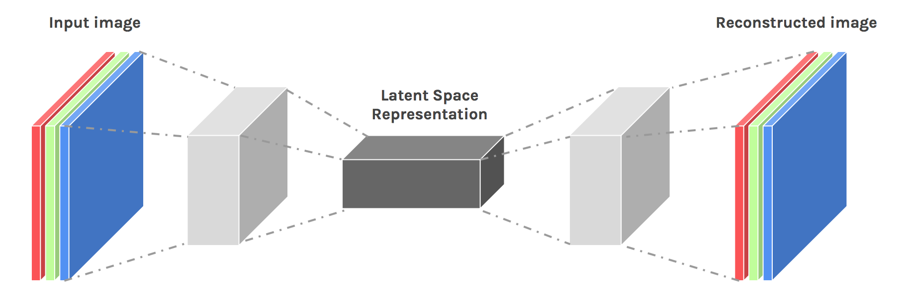

This is a preliminary report about the tutorial on Variational AutoEncoder. This report consists of short summary about the concepts and experiments that will be discussed in the tutorial.

# Outline
- Basics of autoencoders
- Generative models
- Problem Setting
- Connecting Neural Networks in Probability World
- Introduction to Variational autoencoder
- Maths behind Variational autoencoder
- [Code Snippet for VAE](code)
- Experiments 
  - Latent Space Visualizations
  - Visualization of cluster formation
  - Effect of change in weightage for KL divergance during training
  - Effect of weightage of KL divergance on disentangled representation learning
  - Shortcoming of VAE
- Applications of VAE

# Basics of Autoencoders
- Autoencoders are a special type of model where we try to reconstruct the input itself.

- One may ask why do we need to reconstruct the input if we already have the data. 

 
> The idea is pretty straightford here i.e in the process of reconstructing the input we would like the Autoencoder model to learn important properties(aka **features/representation** in machine learning world) which are enough informative to reconstruct the input itself.

{: .center-image }
*Autoencoder Model, [Image Source](https://becominghuman.ai/understanding-autoencoders-unsupervised-learning-technique-82fb3fbaec2)*

- Lets introduce some notations that will be used in upcoming sections
> X ==> input data  
> N ==> Number of instances in training data  
> Xi ==> ith instance of input data  
> D ==> dimension of input data  
> Z ==> dimension of latent space  
> P(X) ==> Probability distribution of Input  

- Now if we closely observe above model, then one can see that first Input image(Xi) is transformed to a latent space representation(Zi) and then reconstructed back to Input image(Xi). So here we expect the Zi to extract important features.

- There are two variants of autoencoder : 
	- _Overcomplete Autoencoders_
	> The autoencoders where **latent space dimension is more than the input dimension** are called as Overcomplete Autoencoders.
	>
	> It seems counter-intuitive in the first reading but it has been empirically shown that provided enough regularization on model parameters we can still can learn good representations.
	>
	> We will not discuss this variant in detail because it is out of the scope of tutorial.
	- _Undercomplete Autoencoders_
	> The autoencoders where **latent space dimension is significantly less than the input dimension** are called as Overcomplete Autoencoders.
	>
	> In this tutorial such type of an autoencoder is discussed in detail.

<!--These are machine learning models under unsupervised learning that come with a goal to learn good representations by trying to reconstruct the input itself. Main problem of autoencoders is not let it learn a identity function which is alleviated by regularized autoencoders(eg Sparse Autoencoders). Sparse Autoencoders come with a motive of getting sparse representations in latent space which essentially means that only few neurons are active for a particular data point. This sparse constraint in latent space forces the model to learn more good representations. In regularized autoencoders, we actually misuse the meaning of regularization. By definition regularization is our prior belief on distribution of model’s parameters where as in regularized autoencoders the regularization is a prior assumed on latent space which is **not on parameters rather on data.**
-->
## Generative Models

- Similar to autoencoders,a generative model also learns in unsupervised fashion.

- In contrast to Autoencoder they come with an objective of generating the data points which follow P(X).

- One can question what can we leverage out of such model. So lets see some use cases :
	> We can generate data points following P(X) on the fly.
	>
	> Henceforth we need not save the dataset once we learn a generative model on it. Mathematically we learn the marginal distribution on X.
	>
	> Moreover one can look learning a generative model as representation learning. (An intuitive explanation for seeing it as representation learning is that if a model can produce instances similar to training data distribution then it must have learned some useful properties about the training instances too).
	>
	> For representation learning, any intermediate reprsentation of the generating model can be used. Empirically it has been observed that penultimate layer serves the purpose best.

- Great! Now we would explore that why is it hard to achieve a generative model.
	> Let's revisit the definition of Generative model i.e models which come with an objective of generating instances similar to P(X) but wait, **do we even know what is P(X) ?**
	>
	> The problem is even if we have some prior knowledge on input data distribution, still approximating marginal distribution of X is intractable.(Under problem setting we will go in more detail)
	>
	> Therefore we would like to make use of inference models which actually tries to infer P(X) by observing X.

<!--These type of machine learning models come with a goal to learn the true data distribution. Intuitive motivation is that if a model is able to generate plausible samples close to train data distribution then it must have learned very well representations too. These are useful where data collection is hard or next to impossible, henceforth we could use generative models to generate samples in order to augment in existing dataset. -->

## Problem Setting
-
		{: .center-image }

- Consider X as input data having "N" i.i.d data points.

- We assume that the input data is generated following a random process which involves a _hidden_ continuous random variable **z**.

- Process of generating data is done in two steps which are as follows : 
	> **Step 1** : Value zi is generated from some prior distribution p&theta;*(z).
	>
	> **Step 2** : Then a value of xi is generated following some conditional distribution i.e p&theta;*(x\|z).
	> 
- We assume that prior p&theta;*(z) and likelihood p&theta;\*(x\|z) come from parametric families of distribution p&theta;(z) and p&theta;(x\|z) respectively.

- Therefore in this problem setting, many things are hidden from us like true parameters(&theta;*) and values zi.

- Let us revisit the point that why learning marginal distribution of X is intractable.
	- Marginal distribution can be written as follows : 

		{: .center-image }

	- Consider latent space to be d dimensional, then the number of integrals will be d in above equation which makes it intractable.

- Now we are ready to define the problems which authors of [VAE](https://arxiv.org/abs/1312.6114) try to solve : 
	> **Maximum likelihood estimation for the parameters &theta;**. One can see their use as mimicing the hidden process to generate data similar to real data.
	>
	> **Approximating posterior inference of latent variable z given a observable value x.**
	> Such inference can be used in representation learning tasks.
	> 
	> **Learning the marginal distribution over X.** 
	> This is useful for the applications where marginals are required, for example denoising.

## Connecting Neural Networks in Probability World

- Lets define an recognition model Q&phi;(z\|x) which is an approximation to true posterior P&theta;(z\|x).

- From coding theory perspective one can look the latent dimension values(zi) as latent codes or representations which are corresponding to data instances(xi).

- Since an encoder in standard autoencoder learns to map each data point(xi) to its corresponding representation(zi) in latent space while a recognition model parametrized by &phi; parameters learns a conditional distribution over latent codes.

- Henceforth one can easily observe that a **recognition model** is nothing but a **probabilistic encoder**.

- In a similar way, we can also say the decoder as **probabilistic decoder** which learns the conditional distribution P(X\|Z).

{: .center-image }

## Introduction to Variational Autoencoder

- Since decoder is a network which transforms a value zi in latent space to a value xi in input space, so the idea is to leverage the decoder in such a way that for every point in latent space it constructs something realistic in input space.

- For analogy one can see a random value in latent space as **imagination** and we would like the decoder to turn this imagination into something **realistic** in input space.

- In the variational autoencoder model, the encoder learns a conditional probability distribution i.e P(z\|x) while the decoder learns a deterministic function which maps a value in latent space to a value in input space.

- Since we want to approximate intratctable true posterior distribution via the encoder's learned distribution in latent space(which is in some arbitrary dimension), therefore the approximation should be multivariate and specifically in VAE model we assume it be a multivariate Gaussian Distribution.

- As with multivariates the covariance matrix increases quadratically with dimesions we restrict the encoder distribution family to diagonal Gaussian distributions. 

- One may ask but how we actually compute the mean & variance in latent space ?
	> Instead of learning representation in latent space for a given data poin, we rather learn the mean & variance of the learned distribution. 

	
{: .center-image }

- As the encoder & decoder networks in an autoencoder are deterministic but we want our **imagination** to be random values in latent space, so this randomness is achieved using **reparametrization trick**.(We will cover about reparametrization later in this blog.)

## Intuition behind VAE

{: .center-image }

- The conditional distribution (i.e P(Z\|X)) in blue color is the one which is **true intractable**(because we have assumed Z to be hidden in our problem setting) distribution where as the one in red color is our approximation to this intractable distribution.

- Our approximation is parametrized by parameters &phi; of the variational encoder network.

- Since we consider decoder as generating black box taking an input value in latent space and mapping it to some realistic value in input space. 

- So one may ask how to choose random values in latent space ?
	> Since there is decades of research available on sampling techniques so idea is to leverage the sampling from some probability distribution(say Q) as a way to generate random values in latent space.
	>
	> Now the values generated(in latent space) by sampling from some probability distribution should also follow the learned distribution by variational encoder else the decoder will not be able to reconstruct the images.
	>
	> Henceforth the learned encoder distribution should be close to the distribution(Q) from which we sample. 
	>
	> In VAE literature we often say Q as **prior distribution**. We term it prior because we model our belief in form of distribution followed by the latent space.
	>
	> KL diveregence is the metric used to compare two probability distributions and in VAE model we use this metric to compare the learned encoder distribution and prior distribution.

<!--Before jumping to VAE, we would like to first connect the autoencoders with probabilistic graphical models. We can view the encoder as approximating conditional probability distribution -- p(z\|x) where z is denoting latent space random var & x is input data point. Similarly decoder can be viewed as approximating a conditional distribution -- q(x\|z). So we would like to use the decoder part as generative model since it learns to map a point in latent space to a point in input space. For a decoder to get trained we also want encoder(only for training) as it provides a meaning full point in latent space corresponding to an input. But issue is that both our encoders & decoders are deterministic functions but a generative model should be stochastic (Eg : stochasticity can be seen as generating images of 3 digit but in different orientations). So to make our traditional Autoencoders stochastic we make use of re-parametrization trick which serves as core of VAE learning. -->

## Maths behind VAE

Let's start with the concept of information. Information carried by a sentence or a statement can be quantified by $$ I = -log(P(x)) $$, where $$x$$ is certain event and $$I$$ is information. Since, value of probability is between 0 and 1. Therefore, if the value of $$P(x)$$ is close to 1 then information is close to 0 and if value of $$P(x)$$ is close to 0 then information gain is very high. Therefore, an unlikely event has very high information and a likely event has very low information.

The average of information is known as entropy. Entropy can be calculated as $$H = -\sum P(x)*log(P(x))$$, which is just the expectation of information $$I$$. 

Assuming there are two different distributions $$P$$ and $$Q$$. Then KL Divergence is the measure of dissimilarity between $$P$$ and $$Q$$. KL-Divergence is a concept which is closely related to Information and Entropy. KL-Divergence between $$P$$ and $$Q$$ is almost equal to Difference in entropy of $$P$$ and $$Q$$. Therefore, $$KL(P\|Q) \sim -\sum Q(x)*log(Q(x)) + \sum P(x)*log(P(x))$$ i.e. Difference in information obtained from distribution P and Q. Therefore, if both distributions are similar then entropy is minimum. However, KL-Divergence is calculated with respect to one distribution. Therefore, KL-Divergence of Q with respect to P can be calculated as $$KL(P\|Q) = -\sum P(x)*log(Q(x)) + \sum P(x)*log(P(x))$$. Therefore, here average information of Q is calculated with repsect to P.
The two important properties of KL-Divergence are as follows 
* KL-Divergence is always greater than equal to 0
* KL-Divergence is not symmetric i.e. $$KL(P\|Q) \ne KL(Q\|P)$$

Therefore, KL-Divergence is not distance measure because distance should be symmetric. KL-Divergence is a measure of dissimilarity between two distributions.

Since, Variational technique is a technique in inference in graphical model so, let start with graphical models. Suppose, we have $$z$$ which is a hidden variable and $$x$$ is an observation. We would like to compute posterior $$P(z \vert x)$$.

$$P(z \vert x) = \frac{P(x \vert z) * P(z)}{P(x)} = \frac{P(x,z)}{P(x)} $$

Computing the marginal distribution $$P(x)$$ is quite complicated. Because $$P(x) = \int P(x \vert z)*p(z) dz$$ and this integral is intractable especially in high dimensional space. Therefore computing the marginal is one of obstacle in graphical models. Roughly there are two main approaches for calculating this integral. 1.) Monte Carlo approach (compute the integral by monte carlo integral using sampling), 2.) Variational Inference. We will use variational Inference.

Since, computing $$P(z \vert x)$$ is not possible therefore, approximate $$P(z \vert x)$$ with another distribution $$Q(z)$$. If $$Q$$ is choosen to be a tractable distribution and if this tractable distribution is made close to the distribution of $$P(z \vert x)$$ then the problem is solved.

Now, Since the problem is to make $$Q(z)$$ as close as possible to $$P(z \vert x)$$. Therefore, now KL-Divergence can be used as a dissimilarity metric. If we can minimize the KL-Divergence between $$P$$ and $$Q$$ then we have obtained a tractable distribution $$Q$$ which is similar to $$P$$.

$$ KL( Q(z) \| P(z \vert x)) = - \sum_z Q(z)* log\bigg(\frac{P(z \vert x)}{Q(z)}\bigg) $$

$$ KL( Q(z) \| P(z \vert x)) = - \sum_z Q(z)* log\bigg(\frac{P(x,z)}{P(x)*Q(z)}\bigg) $$

$$ KL( Q(z) \| P(z \vert x)) = - \sum_z Q(z)* log\bigg(\frac{P(x,z)}{Q(z)} * \frac{1}{P(x)}\bigg) $$

$$ KL( Q(z) \| P(z \vert x)) = - \sum_z Q(z)* \bigg[log\bigg(\frac{P(x,z)}{Q(z)}\bigg) - log(P(x))\bigg] $$

$$ KL( Q(z) \| P(z \vert x)) = - \sum_z Q(z)*log\bigg(\frac{P(x,z)}{Q(z)}\bigg) + \sum_z Q(z)*log(P(x)) $$

Since summation is over z. Therefore, $$log(P(x))$$ can be taken outside of summation.

$$ KL( Q(z) \| P(z \vert x)) = - \sum_z Q(z)*log\bigg(\frac{P(x,z)}{Q(z)}\bigg) + log(P(x)) \sum_z Q(z) $$

Since, $$\sum_z Q(z) = 1$$. Therefore,

$$ KL( Q(z) \| P(z \vert x)) = - \sum_z Q(z)*log\bigg(\frac{P(x,z)}{Q(z)}\bigg) + log(P(x)) $$

$$ log(P(x)) = KL(Q(z) \| P(z \vert x)) + \sum_z Q(z)*log\bigg(\frac{P(x,z)}{Q(z)}\bigg) $$

Given a fixed $$x$$, $$log(P(x))$$ is constant and it is independent of the distribution of $$Q$$.

Lets Denote $$ log(P(x)) $$ term as $$C$$, $$KL(Q(z) \| P(z \vert x))$$ term as $$K$$ and $$ \sum_z Q(z)*log\bigg(\frac{P(x,z)}{Q(z)}\bigg) $$ term as $$L$$.

 Now, we want to minimize $$K$$. As can be seen from equation above, $$K + L$$ is equal to a constant. Therefore, instead of minimizing $$K$$ we can maximize $$L$$. This $$L$$ term is known as Variational Lower Bound. since $$ K \ge 0$$ and $$C = K + L$$. Therefore, $$L \le C$$. Hence $$L$$ is lower bound of $$log(P(x))$$. In variational inference, Variational lower bound is maximized. 

$$ L = \sum Q(z) * log\bigg( \frac{P(x,z)}{Q(z)} \bigg) $$

$$ L = \sum Q(z) * log\bigg( \frac{P(x \vert z)*P(z)}{Q(z)} \bigg) $$

$$ L = \sum Q(z) * \bigg[log(P(x \vert z)) + log\bigg(\frac{P(z)}{Q(z)}\bigg)\bigg] $$

$$ L = \sum Q(z) * log(P(x \vert z)) + \sum Q(z)*log\bigg(\frac{P(z)}{Q(z)}\bigg) $$

$$ L = \bigg(\sum Q(z) * log(P(x \vert z))\bigg) - KL(Q(z) \| P(z)) $$

Here, $$\sum Q(z) * log(P(x \vert z))$$ is the likelihood of observing x given hidden variable z and $$KL(Q(z) \| P(z))$$ is the KL-Divergence between distributions $$P$$ and $$Q$$.
Therefore, Inorder to maximize the variational lower bound $$L$$, we would like to minimize the KL-Divergence and maximize the Likelihood.

{: .center-image }

Consider above graphical model with $$z$$ as the hidden variable and $$x$$ as the observation. $$P(x \vert z)$$ is the mapping from hidden variable to $$x$$. Assume there exists another distribution $$Q(z \vert x)$$ which maps $$x$$ to $$z$$. since, $$P(z \vert x)$$ is hard to compute. Therefore, we want to find another distribution $$Q(z \vert x)$$ which is tractable and similar to $$P(z \vert x)$$. 

{: .center-image }

Let's assume $$Q(z \vert x)$$ is a function is obtained from a neural network which takes input $$x$$ and maps it to $$z$$. Lets assume that $$P(x \vert z)$$ is another neural network which takes this $$z$$ and maps it to $$x$$. We will assume that $$z$$ follows a gaussian distribution.

$$ L = \bigg(\sum Q(z) * log(P(x \vert z))\bigg) - KL(Q(z) \| P(z)) $$

From the equation above we would like to maximize the L term i.e. Minimize the KL-Divergence by bringing $$Q(z \vert x)$$ closer to a gaussian distribution. From $$z$$ to $$x'$$ there is a neural network in form of a decoder. This neural network is completely deterministic not probabilistic. Since there is a deterministic function between $$z$$ and $$x'$$. Therefore, $$P(z \vert x)$$ can be written as $$P(x \vert x')$$. Now, assume that the distribution $$P(x \vert x')$$ follows a gaussian distribution, then there is term of the form $$e^{-\vert x - x' \vert ^2}$$. and now if we take apply on this term then it becomes of the form $$\vert x - x' \vert ^ 2$$. This term is similar to the reconstruction error or L2 loss. Similarly, if we assume that distribution of $$P(x \vert x')$$ is bernoulli then the after applying log it becomes similar to cross entropy loss.

Now, we have a autoencoder available with cost as $$\vert x - x' \vert ^ 2 $$ and a KL-Divergence between $$Q(z \vert x)$$ and a known distribution for example gaussian.

Assuming that the distribution of the $$z$$ is normal. Therefore, the network can't be trained if it produces the latent code $$z$$ directly by sampling because then the gradients won't be obtained. We would therefore like our model to produce the parameters of the normal distribution instead of the code. This parameters can then be used for obtaining the latent code. The network is therefore now supposed to produce two parameters $$\mu$$ and $$\sigma$$. $$\mu$$ is $$d$$-dimensional vector whereas usually $$\sigma$$ is $$d \times d$$-dimensional matrix. For simplicity we would assume $$\sigma$$ to be diagonal i.e. a d-dimensional vector. Therefore, the network is now trained to generate mean and variance which are $$d$$-dimensional. This mean and variance are then used to sample a code from normal distribution. The sample procedure is done a obtaining a d-dimensional random vector $$n$$ and then mulitiplying it with variance and then adding the result to mean i.e. $$ z = \mu + (\sigma * n)$$. Thus this will lead to constraining the network to store the information in the latent code as efficiently as possible.

## Experiments

The main aim of performing experiments is to find some insights that would be helpful in understanding the intuition behind VAE. This experiments would be mainly performed on MNIST and if required some will also be performed on CIFAR10 or fashion MNIST

#### The Experiments are as follows:

* Visualization of the latent space representations
> Visualizing the effect of KL Divergence on the latent space representations. T-SNE will used in order to obtain the visualization of the representation obtained by using KL Divergence and without using KL Divergence. Both the visualizations will be compared in-order to obtain useful statistics and analysis
* Visualization of the cluster formation 
> T-SNE visualization of the representation of latent space in Normal AutoEncoder and Variational AutoEncoder will be compared in order to understand the difference in the cluster formation and the reason behind it.

* Reconstruction Images

Original Image             |  Reconstructed Image
:-------------------------:|:-------------------------:
  |  

* Generation of blurry samples

{: .center-image }

> One of the disadvantages of VAE is that it leads to the generation of blurry samples. we except to demonstrate that effect through this experiment.

* Interpolation in latent space

{: .center-image }

* Experiment fact on learning VAE

{: .center-image }

{: .center-image }

> once we let increase the KL term in loss function then learning is more stable. Intuitively it means once we set a loose bound on learned distribution to match our prior, we get decoder very fast learned and then KL term comes in picture.

* Experiment on effect of weightage of KL-Divergence on Disentaglement of features

{: .center-image }

> The latent code was choosen to be a 10 dimensional vector. Each column in the image above refers to a single dimension in the latent space. The instances in the columns are the reconstructions obtained when a single dimension of a latent code is interpolated from -3 to 3. As can be seen from the results above, first 4 dimensions doesn't contain any useful information about the features whereas the 5th dimension contains information about the position in x-axis. 8th dimension contains information about structure while 10th dimension contains information about the rotaton.

## Applications of VAE

#### Disentangled representation using variational autoencoder

If each dimension in the latent code contains information about only one single feature and insensitive to all other features then the latent code is said to contain information about disentangled representation. The advantage of achieving disentangle representations is the good generalization and interpretability. Some of the examples of disentangled representation is the generation of images of human faces wherein individual features such a hair color, smile and face color can be controlled by varying only the single dimension of the latent code.

$$\beta$$ vae is one of the variation of vanilla vae. Similar to vae, we would like to maximize the likelihood of reconstructing the same input image and also minimize the divergence between the distributions.

$$\max_{\phi ,\theta} E_{x\sim D}[E_{z\sim q_\phi (z\vert x)} log p_\theta (x \vert z)]$$

subject to $$D_{KL}(q_\phi (z \vert x) \| p_\theta (z)) < \delta$$

The above equation can be written in the form of a lagrangian under KKT condition using a lagrangian multiplier $$\beta$$. Therefore, the above constrained equation can be rewritten as maximizing the below equation.

$$F(\theta, \phi, \beta) = E_{z\sim q_{\phi (z \vert x)}} log p_\theta (x \vert z) - \beta (D_{KL}(q_\phi (z \vert x) \| p_\theta (z)) - \delta)$$

$$F(\theta, \phi, \beta) = E_{z\sim q_{\phi (z \vert x)}} log p_\theta (x \vert z) - \beta D_{KL}(q_\phi (z \vert x) \| p_\theta (z)) + \beta \delta$$

$$F(\theta, \phi, \beta) \ge E_{z\sim q_{\phi (z \vert x)}} log p_\theta (x \vert z) - \beta D_{KL}(q_\phi (z \vert x) \| p_\theta (z))$$

Therefore, the total loss function of $$\beta$$-VAE becomes,

$$L_{BETA}(\phi, \beta) = -E_{z\sim q_\phi (z\vert x)} log p_\theta (x\vert z) + \beta D_{KL}(q_\phi (z \vert x) \| p_\theta (z))$$

here, $$\beta$$ is a hyperparameter which is a lagrangian multiplier.

The only difference between vanilla VAE and $$\beta$$-VAE is that in vanilla vae value of $$\beta$$ is 1 while in $$\beta$$-VAE the value of $$\beta$$ is greater than 1.
Therefore, when the value of $$\beta$$ is increased then it enforces more constrain on the network to follows a gaussian distribution and also preserve the relevant information as efficiently as possible this efficient use of the latent code leads to learning of disentangled representation.

#### Denoising Autoencoders

Autoencoders are neural networks which are commonly used for feature extraction or compression. However, if we have same or more number of nodes in the latent space then this will lead the autoencoder to not learn anything useful but to just pass the input as it is through the layers. But if we pass the input with some amount of noise and try to reconstruct the input but without the noise then this extra nodes in the latent space will learn to remove the noise from the input leading to an autoencoder which can be used for denoising the input. Therefore, this type of autoencoder is known as denoising autoencoder.

